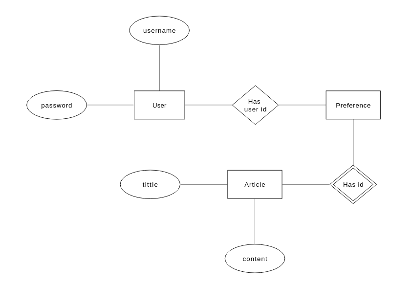

# news-recommendation

This is a spring webflux server which implements TF-IDF based article recommendation engine.


## Authentication and Authorization

Since recommendations require some sort of user profile. so the relevant reactive REST
endpoints are secured using spring Webflux security. We will implement token-based authentication
and authorization using JWT provider.


## Persistent Datastore

[mlab](https://mlab.com) mongodb free tier instance.

## Reactive Weblux

Reactive programming require you to pipe the results from producers to consumer. This way the
intermediate and final results are materialized only if they are needed. Hence there is technically
no thread waiting for io. see the example.
```
  public Mono<ServerResponse> setPreference(ServerRequest request) {
    System.out.println("Start setPreference()");
    Authentication authentication = SecurityContextHolder.getContext().getAuthentication();
    String username = (String) authentication.getPrincipal();
    Mono<Article> item = request.bodyToMono(Article.class);
    return item.flatMap(i -> { i.setV(RunCmd(i)); return Mono.just(i); })
        .flatMap(objectId -> this.feedService.setPreference(objectId, username)
        .flatMap(x -> ServerResponse.ok().contentType(APPLICATION_JSON).bodyValue(x))
        .switchIfEmpty(ServerResponse.notFound().build()));
  }

```

## NLP
The TF-IDF vector based similarity is used in recommendations. It is a very simple similarity
 algorithm but works well is real use cases. Currently, max features is 100 due to
 free tier of mongodb(and there is no native support for vector dot).

## Database ER representation



## References
1. https://towardsdatascience.com/tf-idf-for-document-ranking-from-scratch-in-python-on-real-world-dataset-796d339a4089
2. https://towardsdatascience.com/overview-of-text-similarity-metrics-3397c4601f50

                                               


